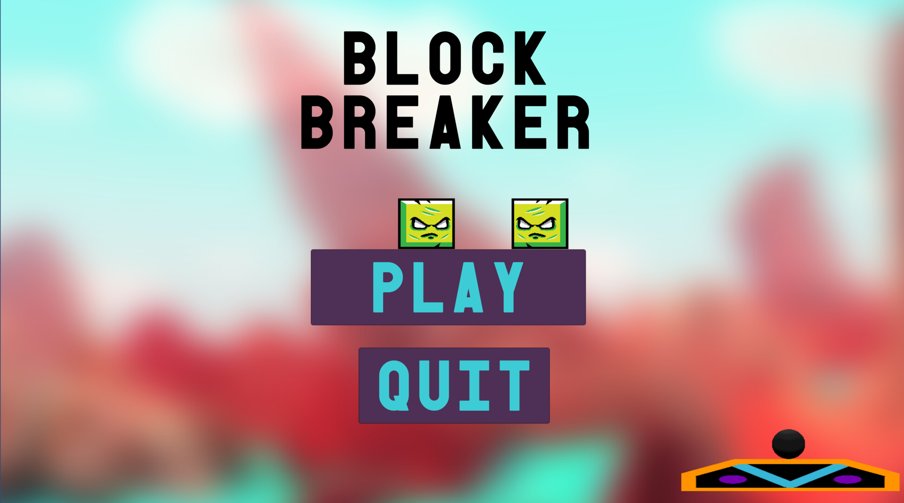

# Block breaker

This project is made following the [Complete C# Unity Game Developer 2D](https://www.udemy.com/share/101WjsA0YZclZQR3Q=/) course.
The game is a remake of arkanoid / breakout, made in Unity 2019.3.2f1. The font used for the headings is [Old Block](https://www.dafont.com/old-block.font) by Vid the Kid.
The background image is taken from [WallpaperCave](https://wallpapercave.com/w/wp1902564).
The sprites of the blocks are taken from [opengameart.org](https://opengameart.org/content/grumpy-block-tileset-game-obstacles), author: [bevouliin.com](https://opengameart.org/users/bevouliincom)
The audio effects are made in LMMS.
Tested on Debian and Windows. The goal of the project was to practice game development, game design skills and game making practices.

## Unity elements, learned through the development of this project
* Physics 2D materials
* Mouse input
* Collider 2D (Collisions and triggers)
* Vectors(Vector2)
* Destroy()
* Persistence between scenes(Singleton)
* Prefabs

# Personal contribution to the project
* Level design
* Mouse hide during gameplay
* Lives system
* More decorated menu scene
* Win Screen
* Scene Loader reorders win screen

# Screenshots

